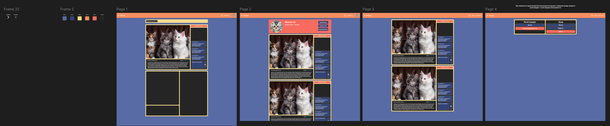

# Принято решение создать экосистему

## Запуск проекта

Для старта необходимо настроить .env файл в backend
Где:
- PORT=порт для работы приложения (опция)
- DATABASE_URL=ссылка на подключение к бд postgres
- SMTP_HOST=хост smtp сервера для мейлинга
- SMTP_PORT=порт smtp сервера
- SMTP_USER=почтовый ящик организации
- SMTP_PASS=пароль почты
- DOMAIN_URL=домен на котором размещена система

### Для чего это нужно?
Система использует платформу контейнеризации docker, она подготовлена для автоматического развертывания без участия человека по процессу ci/cd

Далее необходимо в docker-compose настроить следующие параметры в сервисе postgres:
- POSTGRES_USER: приудмать имя пользователя бд
- POSTGRES_PASSWORD: придумать пароль для пользователя бд
- POSTGRES_DB: postgres_db

## Режим разработки (dev mode)

- Открыть терминал по пути backend
- Выполнить команду `npm i`
- Выполнить команду `npm run dev`
- Получить сообщение в консоли об успешно запуске

- Открыть терминал по пути web
- Выполнить команду `npm i`
- Выполнить команду `npm run dev`
- Ожидать открытия веб-страницы в браузере

### Макеты
- [Макеты + Цвета + Иконки в Figma](https://www.figma.com/design/AdWnK1zgIUx02cbbSkXIgk/Untitled?node-id=0-1&p=f&t=eP5FBNfuEUA3XQio-0)

#### Превью части макетов блога (если не открывается)

## <u>Любые</u> вопросы на почту: <a href="mailto:artemkka1035@gmail.com">artemkka1035@gmail.com</a> буду рад пообщаться :)

## Подробный анализ
|                        Объект анализа                        |                                                                                                                                                                                                                                                                                                                                                                                                                                анализ                                                                                                                                                                                                                                                                                                                                                                                                                                 |
|:------------------------------------------------------------:|:---------------------------------------------------------------------------------------------------------------------------------------------------------------------------------------------------------------------------------------------------------------------------------------------------------------------------------------------------------------------------------------------------------------------------------------------------------------------------------------------------------------------------------------------------------------------------------------------------------------------------------------------------------------------------------------------------------------------------------------------------------------------------------------------------------------------------------------------------------------------:|
|           Факт принятия решения о создании системы           |                                                                                                        Во время факта принятия решения о создании системы возникают логичные вопросы. Что она должна делать? Как выглядеть? Какой функционал иметь? Поэтому важно провести хотя бы минимальную аналитику. В случае данной АС БТ - задания содержащиеся в практической части практики. Проанализировав БТ, я увидел что три запрашиваемые системы могут со-существовать в одной экосистеме, и разделил их на 3 эпика каждый из которых привности существвенный функционал в экосистему. Далее я разделил эпики на истории, все объекты я создал в таск-трекере jira которые позже разделил на задачи для удобства разработки и организации итеративной доставки                                                                                                        |
|                  Проблема разных окружений                   |                                                                                 При создании системы я хотел что бы она была универсальная в развертывании, отказоустойчивая и простая в установке. Для Решения этой задачи я использовать контенеризацию docker которая позволяет описать нужное окружение для работы системы в единственной экземпляре. Для организации сервисов я решил использовать compose, это плагин для docker который позволяет создавать целые пространства из контейнеров, создавать виртуальные сети и так далее. От использования Docker swarm я решил отказаться, пусть он и привносит очень важные возможности, например по высочайшему уровню безопасности хранения паролей и секретов, но для масштаба данной экосистемы его возможности избыточны.                                                                                  |
|          Проблемы с автоматической типизацией в JS           |                                                                                                                                                                                                                                                            Возможно динамическая типизация и кажется преимуществом JS, однако последние годы современного фронтенда динамическая типизация лишь привносит проблем. Изначально данная проблема решалась с помощью jsdoc типизации, однако сейчас существует надстройка над js которая называется TypeScript. Она позволяет писать типобезопасный код на JS.                                                                                                                                                                                                                                                            |
|               Контракты между фронтом и беком                |                                                                                                                        Как говорилось раннее, в JS существуют проблемы типизации. После добавления TypeScript в проект у нас появилась типизация, так что дальше? Дальше у нас имеется возможность "подружить" фронт и бек единым типом контракта. В случае данного проекта используются zod-схемы, это библиотека которая позволяет создавать схематичные типы и преобразовывать их в OpenApi схемы. Далее со стороны фронта используется библиотека swagger-typescript-api которая занимается генерацией типов, заданных на бекенде. После генерации мы получаем аналогичные типы на фронте которые может использовать в запросах на бекенд.                                                                                                                        |
| Использование проекта другими разработчиками, пользователями |                                                                                                                                                                                                                                                                               Если проект будет в будущем иметь enterprise или opensource решение, логично будет предположить что разворачиванием и поддержкой приложения будут заниматься другие разработчики, для этого нужна качественная документация, документ который Вы читаете это классная, и надеюсь понятная документация :)                                                                                                                                                                                                                                                                               |
|                     Безопасность данных                      | Вопрос безопасности в современных системах является одним из самых приоритетных, используется множество средств защиты, таких как CORS, хеширование, токенизация и так далее. Если CORS - политика это по большей части ответственность браузера и лишь немного бекенда, то авторизация это уже ответственность разрабатываемой АС. В этом проекте я принял решение работать современным способом, с помощью access и refresh токенов. access токен - это короткоживущий токен которым пользователь получает информацию, в  случае когда access токен закончил свой срок действия, он обновляется с помощью refresh токена. Если refresh токен закончил свой срок действия в данной АС принято решение попросить пользователя перелогиниться. Однако, если пользователь регулярно пользуется системой это не понадобится т.к. refresh токен обновится самостоятельно. |
|                       Макеты и визуал                        |                                                                                                                                                                                                                                                                                                                       Макеты это всегда хорошо, без макетов очень сложно понять что, где и как должно работать. Макеты можно показать заказчику что тоже повышает такие метрики как CSI (метрика удовлетворенности пользователей и заказчиков).                                                                                                                                                                                                                                                                                                                       |
|                  Почему именно такой стек?                   |                                                                                                                                                                                                                                               Все очень просто, любое современное приложение должно быть <u>современным</u>, поэтому и стек выбран с учетом актуальных и свежих технологий используемых в биг-техах. Например похожий стек используется в Т-Банке, безусловно они используют свои фреймворки такие как "Трамвай", однако и задачи у них гораздо масштабнее, да и сами они начинали с обычного Реакта :)                                                                                                                                                                                                                                               |

## Рекмондации по устранению выявленных ошибок

|                            Ошибка                             |                                                             Рекомендация                                                              |
|:-------------------------------------------------------------:|:-------------------------------------------------------------------------------------------------------------------------------------:|
|                           TypeError                           |                                              Использование типизациии для JS: Typescript                                              |
|     Ошибки при разворачивании системы в разных окружениях     |                                       Использование Docker для создания единой среды выполнения                                       |
|           Сложный старт новоприбывшего разработчика           |                                    Написание подробной и понятной документации в README/Confluence                                    |
| Полный доступ к аккументам пользователей в случае утечки базы |                             Использование функций хеширования и "подсаливания" паролей (например bcrypt)                              |
|      Несогласованность контрактов между фронтом и беком       | Использование документаций на базе openapi в связке со swagger ui, создание типов на беке, подтягивание их на фронте через генераторы |
|      Большое использование ресурсов сервера авторизацией      |                    Отказ от создания сессий, переход на подход oauth 2.0 используя пару токенов (access, refresh)                     |
|              Возможная кража токенов авторизации              |                           Использование fingerprint отпечатка браузера для идентификации источника токенов                            |

## ТЗ:

- Необходимо создать web-страницу
- Создать функцию регистрации/входа пользователя
- Создать функцию написания своего поста
- Создать функцию подписки на пользователей
- Создать генерацию списка на основе подписок на пользователей
- Создать функцию просмотра публичных постов
- Создать функцию скрытого поста “только по запросу”
- Создать функцию редактирования/удаления поста
- Предоставить возможность пользователю добавлять и сортировать посты по тегам
- Добавить возможность комментировать посты
- Опишите подробный анализ по выполненной задаче (не менее 7 пунктов)
- Опишите рекомендации по устранению выявленных ошибок в ходе выполнения задачи
## -
-	Создать 2 интерфейса: администратора и пользователя.
-	Создать базу данных Ваших любимых книг.
-	Для пользовательского интерфейса добавить возможность просмотра книги из библиотеки
-	Добавить возможность сортировки на основе:
-	Категории
-	Автора
-	Года написания
-	Добавить функцию покупки или аренды книги сроком на 2 недели / месяц / 3 месяца
-	Для администратора добавить возможность изменения списка книг, управления ценой, статусы книг и их доступность, возможность напоминать пользователям об окончании срока аренды (автоматически)
-	Опишите подробный анализ по выполненной задаче (не менее 7 пунктов)
-	Опишите рекомендации по устранению выявленных ошибок в ходе выполнения задачи
## -
-	Необходимо создать web-сайт, используя любой стек технологий Web-разработки
-	Создать пользователя системы
-	Создать для пользователя функцию записи своего путешествия
-	Создать функцию просмотра путешествий других пользователей
-	Добавить 3 из перечисленных функций о путешествии:
-	Местоположение (с привязной к геопозиции)
-	Изображение мест
-	Стоимость путешествия
-	Места культурного наследия
-	Места для посещения
-	Оценка удобства передвижения / безопасности / населенности / растительности  
-	Опишите подробный анализ по выполненной задаче (не менее 7 пунктов)
	Опишите рекомендации по устранению выявленных ошибок в ходе выполнения задачи
